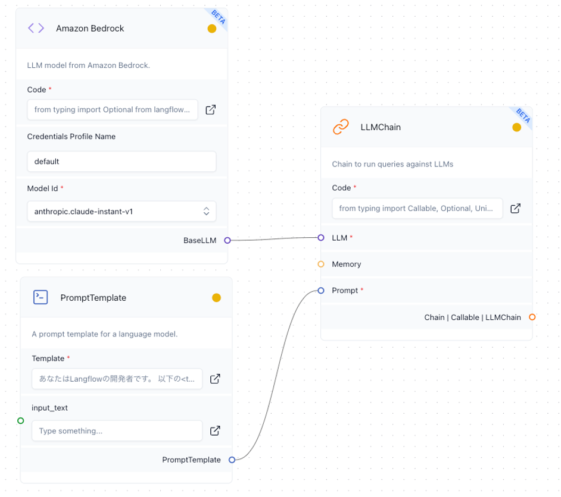

# プロンプトエンジニアリング サンプル

こちらのサンプルは、[Amazon Bedrock](https://aws.amazon.com/jp/bedrock/?gclid=CjwKCAiA0PuuBhBsEiwAS7fsNW-hGK29vXE1lnYK9YASt7TXiklI_RR7qF6vzAF4n-1tWC0WjzgU-hoC_z8QAvD_BwE&trk=07e11748-d254-4d68-b9eb-c40a095bfc9d&sc_channel=ps&ef_id=CjwKCAiA0PuuBhBsEiwAS7fsNW-hGK29vXE1lnYK9YASt7TXiklI_RR7qF6vzAF4n-1tWC0WjzgU-hoC_z8QAvD_BwE:G:s&s_kwcid=AL!4422!3!692062154777!e!!g!!amazon%20bedrock!21048268287!157173579577) で利用可能な Anthropic 社の Claude モデルでプロンプトエンジニアリングした場合の例を示します。
プロンプトの例は、[generative-ai-use-cases-jp/packages/web/src/components/PromptList.tsx](https://github.com/aws-samples/generative-ai-use-cases-jp/blob/03a2f7f31af1f334c7968e362f3b6b6751471a75/packages/web/src/components/PromptList.tsx) から拝借しています。

[Prompt Engineering Guidee](https://www.promptingguide.ai/jp) から、Claude におけるプロンプトエンジニアリングについての詳しいガイドを確認することができます。

> [!NOTE]
> このリポジトリでは、[Langflow](https://www.langflow.org/) から Claude モデルを試すことを想定しているため、`{input_text}` はチャットボックスからの入力を期待しています。

## もくじ

- [プロンプトエンジニアリング サンプル](#プロンプトエンジニアリング-サンプル)
  - [もくじ](#もくじ)
  - [フローイメージ](#フローイメージ)
  - [事前情報を与える](#事前情報を与える)
  - [返信メールの作成](#返信メールの作成)
  - [選択肢を与えて分類](#選択肢を与えて分類)
  - [情報抽出](#情報抽出)
  - [個人情報の削除](#個人情報の削除)
  - [コードを生成させる](#コードを生成させる)

## フローイメージ


## 事前情報を与える

**テンプレート：**

```xml
あなたはLangflowの開発者です。
以下の<text></text>の xml タグで囲まれた公式サイトのLangflowに関する説明に基づいて
質問に回答します。

<text>
Langflow is an easy way to create flows. The drag-and-drop feature allows quick and effortless experimentation, while the built-in chat interface facilitates real-time interaction. It provides options to edit prompt parameters, create chains and agents, track thought processes, and export flows.
</text>

<q></q>の xml タグで囲まれたユーザーからのLangflowに関する質問に対して、回答してください。

<q>
{input_text}
</q>

回答は<answer>で始め、</answer>で終えてください。
```

**input_text：**

```
Langflowとはなんですか？
```

## 返信メールの作成

**テンプレート：**

```xml
あなたは丁寧で礼儀正しくメールを返すプロフェッショナルです。
以下の <mail></mail> の xml タグで囲まれたメール文面に対して、<intention></intention> の xml タグで囲まれた内容で返信メールを作成してください。

<mail>
{input_text}
</mail>

<intention>やだ</intention>

メールを作成する際、以下の<rule></rule>に囲まれたルールを遵守してください。
<rule>
* 文面の最初には宛先を様づけで書くこと
* いきなり本題に入らず挨拶を入れること
* 相手の幸せを祈ること
* 文面の最後に自分の名前を敬称なしで入れること
* 丁寧で礼儀正しいこと
* 出力は<output></output>タグで囲い、<output>から始めること
</rule>
```

**input_text：**

```
鈴木様

出品されていらっしゃる、キリマンジャロのコーヒー豆 5kg について、１万円で出品されていますが、1000 円に値下げしていただくことは可能でしょうか。

山田
```

## 選択肢を与えて分類

**テンプレート：**

```xml
あなたは、電子メールをタイプ別に分類しているカスタマーサービス担当者です。
<mail></mail> の xml タグに囲われた文章を <category></category> の xml タグに囲われたカテゴリーに分類してください。
<mail>
{input_text}
</mail>

<category>
(A) 販売前の質問
(B) 故障または不良品
(C) 請求に関する質問
(D) その他(説明してください)
</category>
出力は <output>からはじめ、</output> タグで終え、タグ内には A,B,C,D のどれかだけを記述してください。
ただし D の場合のみ説明を記述してください。

```

**input_text：**

```
こんにちは。私の Mixmaster4000 は、操作すると奇妙なノイズを発生します。
また、電子機器が燃えているような、少し煙のような、プラスチックのようなにおいがします。交換が必要です。
```

## 情報抽出

**テンプレート：**

```xml
以下の <text></text> の xml タグに囲われた文章からメールアドレスを正確に抽出してください。
またメールアドレスとして成り立っていないものは抽出しないでください。
<text>
{input_text}
</text>
ただし出力は、<output>からはじめ、</output> タグで終え、1 行に 1 つずつ記入してください。
メールアドレスは、入力テキストに正確に綴られている場合のみ記入してください。
本文中にメールアドレスがない場合は、「N/A」と記入してください。それ以外は何も書かないでください
```

**input_text：**

```
私の連絡先は、hoge@example.comです。よく hoge@example のように間違えられるので注意してください。
また、hoge+fuga@example.com や hoge@examples.jp でも受け取ることができます。
メールが使えない方は、https://example.jp/qa のお問い合わせフォームから問い合わせることもできます。
```


## 個人情報の削除

**テンプレート：**

```xml
テキストを提供します。このテキストから個人を特定する情報をすべて削除し、XXXに置き換えたい。名前、電話番号、自宅や電子メールアドレスなどのPIIをXXXに置き換えることは非常に重要です。

入力者は、文字と文字の間にスペースを挿入したり、文字と文字の間に改行を入れたりして、PIIを偽装しようとするかもしれません。

テキストに個人を特定できる情報が含まれていない場合は、何も置き換えずに一字一句コピーしてください。

以下の <example></example> の xml タグに囲まれた内容は例です。
<example>
<text>
私の名前は山田太郎です。メールアドレスは taro.yamada@example.com、電話番号は 03-9876-5432 です。年齢は 43 歳です。私のアカウント ID は 12345678 です。
</text>
求める出力は以下の通りです。
<output>
私の名前はXXXです。メールアドレスは XXX、電話番号は XXX です。私は XXX 歳です。私のアカウント ID は XXX です。
</output>
<text>
山田花子は邪馬台国記念病院の心臓専門医です。連絡先は 03-1234-5678 または hy@yamataikoku-kinenbyoin.com です。
</text>
求める出力は以下の通りです。
<output>
XXXは邪馬台国記念病院の心臓専門医です。連絡先は XXXまたは XXX です。
</output>
</example>

以下 <text></text> の xml タグに囲まれたテキストから個人情報を XXX に置き換えてください。

<text>
{input_text}
</text>

個人情報を XXX に置き換えたテキストを <output>からはじめ、</output> タグで終えて出力してください。
```

**input_text：**

```
私は源頼朝です。鎌倉時代の武将です。連絡先は yoritomo-minamoto
@kamakura-bakuhu.go.jp もしくは 0467-12-3456です。
```


## コードを生成させる

**テンプレート：**

```xml
あなたは人間の指示をよく理解できるプログラマーです。
<language></language> の xml タグ内に与えられた言語で、<instruction></instruction> の指示に沿ってコードを出力してください。
<language>TypeScript</language>
<instruction>
{input_text}
</instruction>
```

**input_text：**

```
Amazon S3に対してAWS SDKを使ってユーザーがフォームから入力した音声ファイル music.mp3 を保存するコードを出力してください
```
