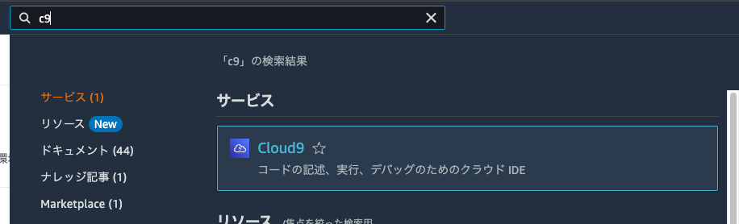

# デプロイ手順

こちらの手順は、Langflow を AWS にデプロイするための手順が記載してあります。

## もくじ

- [デプロイ手順]](#デプロイ手順)
  - [もくじ](#もくじ)
  - [1. CloudshellからLangflow実行環境を立ち上げる](#1-CloudshellからLangflow実行環境を立ち上げる)
  - [2. Langflowをデプロイする](#2-Langflowをデプロイする)
  - [3. Langflowにアクセスする](#3-Langflowにアクセスする)


## 1. CloudshellからLangflow実行環境を立ち上げる

1. [CloudShell](https://us-west-2.console.aws.amazon.com/cloudshell/home?region=us-west-2) にアクセスする
    
1. 以下のコードをターミナルに貼り付ける
    ```
    git clone https://github.com/aws-samples/cloud9-setup-for-prototyping
    cd cloud9-setup-for-prototyping
    jq '.name |= "c9-for-pip-langflow-0.6.8"' params.json > tmp.json && mv tmp.json params.json
    jq '.image_id |= "amazonlinux-2023-x86_64"' params.json > tmp.json && mv tmp.json params.json
    ./bin/bootstrap
    ```
    このような注意書きが表示されたら、チェックボックスにチェックした上で ```貼り付け``` ボタンをクリックして下さい
      
1. ```Done!```という表示が出力されるのを確認する
  

## 2. Langflowをデプロイする
1. [Cloud9](https://us-west-2.console.aws.amazon.com/cloud9control/home?region=us-west-2#/) にアクセスする
    
1. 作成された Cloud9 を開く
    
1. コンソールに表示される ```+マーク``` をクリックし、```New Terminal``` をクリックする
    
1. 以下のコードをターミナルに貼り付ける
  ```    
  sudo dnf install -y gcc zlib-devel bzip2-devel readline-devel sqlite sqlite-devel openssl-devel tk-devel libffi-devel xz-devel 

  curl https://pyenv.run | bash
  echo 'export PYENV_ROOT="$HOME/.pyenv"' >> ~/.bashrc
  echo 'command -v pyenv >/dev/null || export PATH="$PYENV_ROOT/bin:$PATH"' >> ~/.bashrc
  echo 'eval "$(pyenv init -)"' >> ~/.bashrc
  echo 'export LD_LIBRARY_PATH=$LD_LIBRARY_PATH:/usr/local/lib' >> ~/.bashrc

  source ~/.bashrc
  CFLAGS=-I/usr/include/openssl LDFLAGS=-L/usr/lib pyenv install -v 3.11.5

  pyenv global 3.11.5
  pyenv rehash

  pip install -U pip
  pip install langflow==0.6.8
  langflow run --port 8080
  ```
1. 画面上部の ```Preview``` ボタンをクリックし、```Preview Running Application``` ボタンをクリックする。
    
  以下の画面が表示されたら、```Browser``` ボタンをクリックする
    
  このような画面が表示されれば完了です！
    


